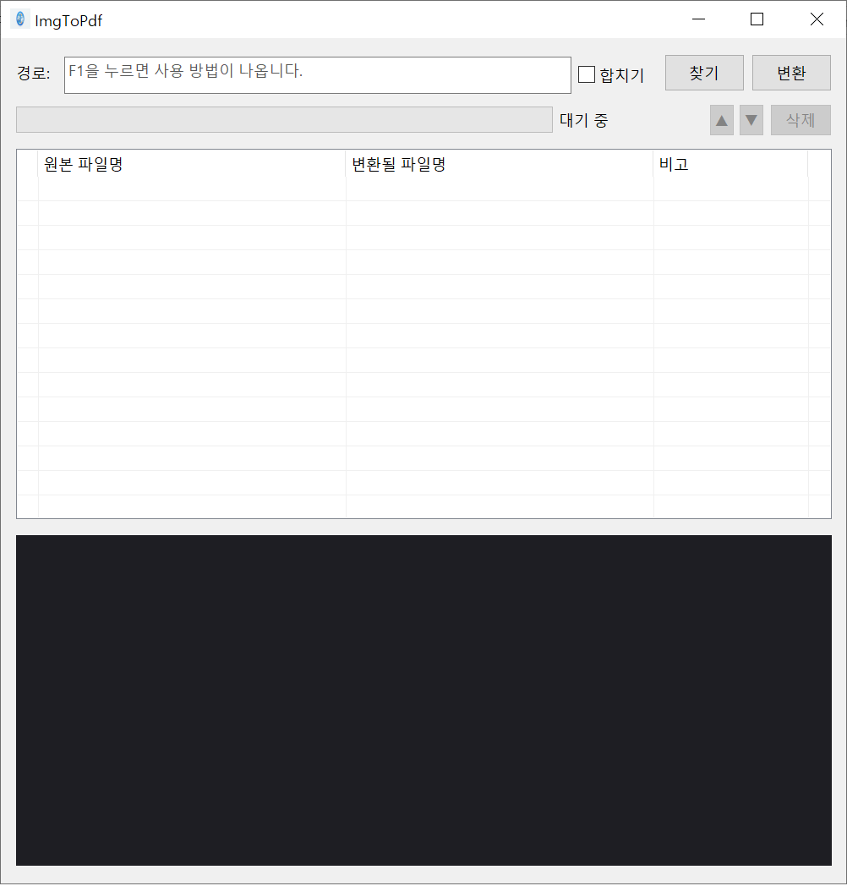

# ImgToPdf

> Windows MFC 기반 다기능 파일 변환 데스크톱 앱 — 이미지 ↔ PDF · PDF 도구 · Markdown 변환

[](https://www.microsoft.com/windows)
[](https://docs.microsoft.com/cpp)
[](https://github.com)
[](LICENSE)

[English README →](README.en.md)

---

## 개요

ImgToPdf는 외부 라이브러리 없이 Windows 10 기본 API만으로 동작하는 파일 변환 도구입니다.  
3개의 탭으로 이미지·PDF·Markdown 변환을 하나의 창에서 처리하며, 한국어/영어 런타임 전환을 지원합니다.  
탭2에서 **로컬 AI(Ollama)로 PDF 내용을 자동 요약**할 수 있습니다 — 인터넷 연결·API 키 불필요.

```
┌──────────────────────────────────────────────────────────────────────┐
│  ImgToPdf v2.0                                          [─][□][✕]   │
├──────────────────────────────────────────────────────────────────────┤
│  ┌─────────────┐  ┌─────────────┐  ┌─────────────┐   [◀] [▶]       │
│  │ 이미지 변환 │  │   PDF 도구  │  │   MD 변환   │                  │
│  └─────────────┘  └─────────────┘  └─────────────┘                  │
│ ┌──────────────────────────────────────────────────────────────────┐ │
│ │                  활성 탭 자식 다이얼로그 영역                    │ │
│ └──────────────────────────────────────────────────────────────────┘ │
│  경로: [___________________________________]  [찾기]  [변환/실행]    │
│  [██████████░░░░░]  (3 / 1 / 10)  [▲] [▼] [삭제]                    │
└──────────────────────────────────────────────────────────────────────┘
```



---

## 주요 기능

### 탭 1 — 이미지 변환

| 기능 | 설명 |
|------|------|
| 이미지 → PDF | JPG · PNG · BMP · TIFF · GIF → 개별 PDF 또는 다중 페이지 합치기 |
| PDF → JPG | PDF 페이지별 JPG 추출 (품질 90, WinRT `Windows.Data.Pdf` 사용) |
| 드래그 앤 드롭 | 파일 · 폴더 드롭 지원, 중복 자동 제거 |
| 병렬 변환 | `hardware_concurrency()` 기반 워커 스레드 풀 |
| 이미지 미리보기 | 목록 클릭 시 GDI+ 비율 유지 Fit 렌더링 |
| 순서 변경 | ▲▼ 버튼으로 변환 순서 조정 |
| 진행 상태 | 프로그레스바 + 3색 카운터 `(완료 / 실패 / 총계)` 실시간 표시 |
| 삭제 이중 모드 | 변환 전: 선택 항목 제거 / 완료 후: 전체 초기화 |

### 탭 2 — PDF 도구

| 기능 | 설명 |
|------|------|
| 나누기 | PDF를 페이지별 개별 PDF로 분할, 또는 범위 지정 분할 (예: `1-3,5,7-9`) |
| 합치기 | 여러 PDF를 하나로 병합 (▲▼으로 순서 조정) |
| 페이지 추출 | 지정 페이지만 추출 → 단일 PDF 또는 페이지별 개별 PDF |
| **AI 요약** | 선택한 PDF를 WinRT OCR로 텍스트 인식 → 로컬 Ollama(llama3.2:3b)로 구조화 요약 생성 |
| 메모장으로 열기 | 요약 결과를 메모장에서 열어 저장·편집 가능 |
| 요약 언어 선택 | 한국어 / English 라디오 버튼으로 요약 출력 언어 선택 |

### 탭 3 — MD 변환

| 기능 | 설명 |
|------|------|
| HTML 변환 | Markdown → UTF-8 BOM HTML |
| PDF 변환 | Markdown → PDF (RTF 렌더링 → A4 페이지 분할) |
| HTML+PDF | HTML과 PDF 동시 생성 |
| 미리보기 | 목록 클릭 시 RichEdit에서 변환 미리보기 표시 |

### 공통 기능

| 기능 | 설명 |
|------|------|
| 탭 순서 변경 | ◀▶ 버튼으로 탭 위치 이동, 앱 재시작 후에도 순서 유지 |
| 런타임 언어 전환 | 시스템 메뉴 → `Switch to English` / `한국어로 전환` (재시작 불필요) |
| 인앱 도움말 | F1 키 또는 시스템 메뉴 → 사용 방법 표시 |
| 한글 경로 지원 | 입출력 경로 한글 완전 지원 |
| 우클릭 메뉴 | 항목 제거 · 파일 위치 열기 · 파일 열기 · 전체 삭제 |

---

## 요구사항

| 항목 | 최소 사양 |
|------|-----------|
| OS | Windows 10 버전 1803 이상 |
| 빌드 도구 | Visual Studio 2022 (v143 툴셋) |
| Windows SDK | 10.0 이상 |
| 런타임 | Visual C++ 재배포 패키지 (MFC Dynamic) |
| AI 요약 (선택) | [Ollama](https://ollama.com) + `llama3.2:3b` 모델 (로컬 실행, 인터넷 불필요) |

---

## 설치

### 인스톨러 사용 (권장)

1. [Releases](../../releases) 페이지에서 `ImgToPdf_Setup_v2.1.exe` 다운로드
2. 실행 후 설치 마법사 진행
3. **앱 언어 선택** 단계에서 `한국어 (Korean)` 또는 `English` 선택
4. 설치 완료 후 **Ollama 자동 설치 여부** 확인 → 동의 시 자동 다운로드·설치
5. 이전 버전이 있으면 자동으로 제거 후 설치

> 관리자 권한 없이 설치 가능합니다.

### 직접 빌드

```bash
# Release x64 빌드
msbuild ImgToPdf.vcxproj /p:Configuration=Release /p:Platform=x64
```

또는 `ImgToPdf.sln`을 Visual Studio 2022에서 열고 `Release | x64`로 빌드합니다.

#### 설치 파일 빌드

1. [Inno Setup 6.x](https://jrsoftware.org/isdl.php) 설치
2. `Release x64` 빌드 완료 확인
3. `installer\ImgToPdf_setup.iss` → Inno Setup Compiler에서 **F9**
4. `installer\ImgToPdf_Setup_v2.1.exe` 생성

> `x64\Release` 폴더에 `mfc142u.dll`, `msvcp140.dll`, `vcruntime140.dll`, `vcruntime140_1.dll`이 있으면 설치 파일에 자동 포함됩니다.

---

## 사용법

### 이미지 → PDF

1. 이미지 파일을 드래그 앤 드롭하거나 **[찾기]** 로 추가
2. *(선택)* **합치기** 체크 → 모든 이미지를 하나의 다중 페이지 PDF로 합침
3. *(선택)* **▲▼** 으로 순서 조정
4. **[변환]** 클릭 → 원본 파일과 같은 폴더에 저장

### PDF → JPG

1. PDF 파일을 목록에 추가 → 페이지 수 자동 스캔
2. **[변환]** 클릭 → `원본명_p001.jpg`, `원본명_p002.jpg`, … 저장

### PDF 나누기 / 합치기 / 추출 (탭 2)

- **나누기**: PDF 추가 → 페이지별 또는 범위 입력 (예: `1-3,5,7`) → **[실행]**
- **합치기**: PDF 여러 개 추가 → ▲▼ 으로 순서 조정 → 출력 파일명 입력 → **[실행]**
- **페이지 추출**: PDF 추가 → 추출할 페이지 입력 (예: `1,3,5-7`) → **[실행]**

### AI 요약 (탭 2)

> Ollama가 로컬에서 실행 중이어야 합니다 (`http://localhost:11434`).

1. 목록에서 PDF 파일 선택
2. 요약 언어 선택: `● 한국어` 또는 `○ English`
3. **[요약]** 클릭 → OCR 인식 후 Ollama로 구조화 요약 생성
4. 결과 확인 후 **[메모장]** 클릭 → 메모장에서 열기·저장 가능

요약 출력 형식:
```
[개요]
(4~6문장 핵심 요약)

[주요 내용]
• 포인트 1
• 포인트 2  …

[결론 및 시사점]
(3~4문장)
```

#### Ollama 설정 (최초 1회)

```bash
# 1. https://ollama.com 에서 Ollama 설치 (또는 앱 설치 시 자동 설치)
# 2. 모델 다운로드
ollama pull llama3.2:3b
```

### MD 변환 (탭 3)

1. `.md` / `.markdown` 파일을 추가
2. 출력 형식 선택: `HTML` / `PDF` / `HTML+PDF`
3. *(선택)* 출력 폴더 지정 (비우면 원본 폴더에 저장)
4. **[변환]** 클릭

### 언어 전환

창 좌상단 `─` (시스템 메뉴) → **Switch to English** 클릭 → 즉시 전환 (재시작 불필요)

---

## 빌드 옵션

| 항목 | 값 |
|------|----|
| C++ 표준 | C++17 |
| 문자셋 | Unicode |
| MFC | Dynamic (`UseOfMfc=Dynamic`) |
| 추가 컴파일 플래그 | `/utf-8` |
| 링크 라이브러리 | `gdiplus.lib` `shell32.lib` `runtimeobject.lib` `shcore.lib` |
| ComCtl32 | v6 (linker manifest pragma 활성화) |

---

## 기술 스택

| 역할 | 기술 |
|------|------|
| UI 프레임워크 | MFC `CDialogEx` / `CTabCtrl` / 자식 다이얼로그 |
| 이미지 로딩 | [`stb_image.h`](https://github.com/nothings/stb) (헤더 온리, 서드파티) |
| 이미지 렌더링 | GDI+ (`Gdiplus::Bitmap`) |
| PDF 생성 | PDF 1.4 스트림 직접 구현 (외부 라이브러리 없음) |
| PDF 읽기·렌더링 | `Windows.Data.Pdf` WinRT API (Windows 10 내장) |
| WinRT 래핑 | WRL + SyncWait 패턴 (비동기 → 동기 변환) |
| MD 변환 | 내장 `MdConverter` — Markdown → RTF → `EM_FORMATRANGE` A4 렌더링 |
| 병렬 처리 | `std::thread` + `std::atomic<int>` lock-free 인덱스 분배 |
| 언어 전환 | C++ `wchar_t*` 배열 (`s_ko[]`/`s_en[]`) + `LS()` 헬퍼 |
| AI 요약 (OCR) | `Windows.Media.Ocr` WinRT API (Windows 10 내장) |
| AI 요약 (LLM) | WinHTTP → Ollama REST API (`llama3.2:3b`, 로컬) |
| 설치 파일 | Inno Setup 6.x (Ollama 자동 설치 지원) |

---

## 프로젝트 구조

```
ImgToPdf/
├── ImgToPdf.sln / .vcxproj
├── AppMessages.h               ← 커스텀 WM_USER 메시지 상수
├── resource.h                  ← 컨트롤 ID, 다이얼로그 ID
├── ImgToPdf.rc                 ← 다이얼로그 템플릿
├── pch.h / pch.cpp             ← 프리컴파일드 헤더
│
├── AppLang.h / .cpp            ← 런타임 언어 전환 (LS, BuildFilter)
├── TabDlgBase.h                ← 탭 공통 인터페이스
│
├── ImgToPdf.h / .cpp           ← 앱 진입점, GDI+ 초기화
├── ImgToPdfDlg.h / .cpp        ← 메인 다이얼로그 (탭 컨테이너)
│
├── ImgConvertDlg.h / .cpp      ← 탭1: 이미지 ↔ PDF 변환
├── PdfToolsDlg.h / .cpp        ← 탭2: PDF 나누기·합치기·추출
├── MdConvertDlg.h / .cpp       ← 탭3: Markdown → HTML/PDF
│
├── FileListCtrl.h / .cpp       ← 커스텀 CListCtrl (상태 아이콘·행 배경색)
├── ImagePreviewCtrl.h / .cpp   ← GDI+ 이미지 미리보기
├── ProgressLabel.h / .cpp      ← 3색 카운터 레이블
├── ConvertWorker.h / .cpp      ← 이미지 변환 스레드 풀
├── PdfWriter.h / .cpp          ← PDF 1.4 스트림 생성
├── PdfConverter.h / .cpp       ← WinRT PDF 읽기·JPG 렌더링
├── MdConverter.h / .cpp        ← Markdown → RTF/HTML 변환
│
├── installer/
│   └── ImgToPdf_setup.iss      ← Inno Setup 설치 스크립트
│
└── third_party/
    └── stb_image.h
```

---

## 지원 파일 형식

### 입력

| 종류 | 확장자 |
|------|--------|
| 이미지 | `.jpg` `.jpeg` `.png` `.bmp` `.tiff` `.tif` `.gif` |
| PDF | `.pdf` |
| Markdown | `.md` `.markdown` |

### 출력

| 변환 종류 | 출력 파일 |
|-----------|-----------|
| 이미지 → PDF (개별) | `원본명.pdf` |
| 이미지 → PDF (합치기) | `원본명_통합.pdf` |
| PDF → JPG | `원본명_p001.jpg`, `_p002.jpg`, … |
| PDF 나누기 | `원본명_p001.pdf`, `_p002.pdf`, … |
| PDF 나누기 (범위) | `원본명_range1.pdf`, `_range2.pdf`, … |
| PDF 합치기 | `지정파일명.pdf` |
| PDF 추출 (단일) | `원본명_extracted.pdf` |
| Markdown → HTML | `원본명.html` |
| Markdown → PDF | `원본명.pdf` |

---

## 제작자

- **jaeho**
- pim9697@gmail.com

---

## 라이선스

[MIT License](LICENSE)
